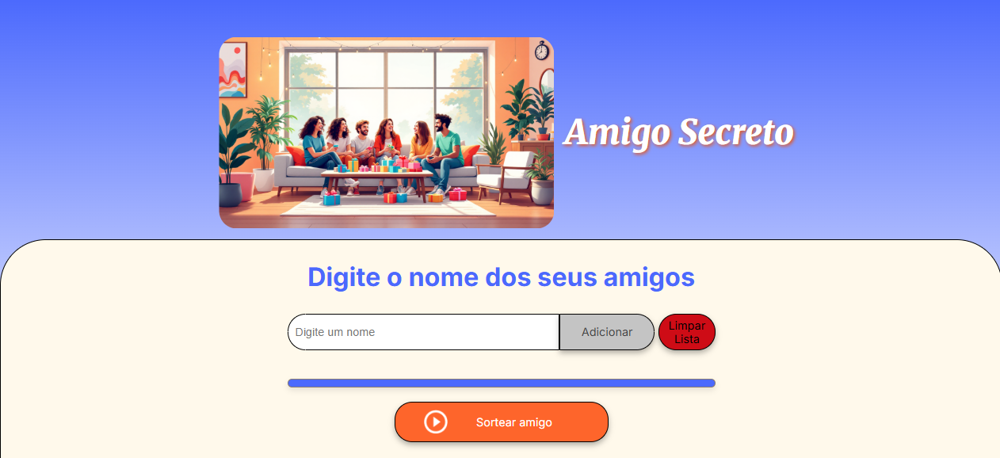
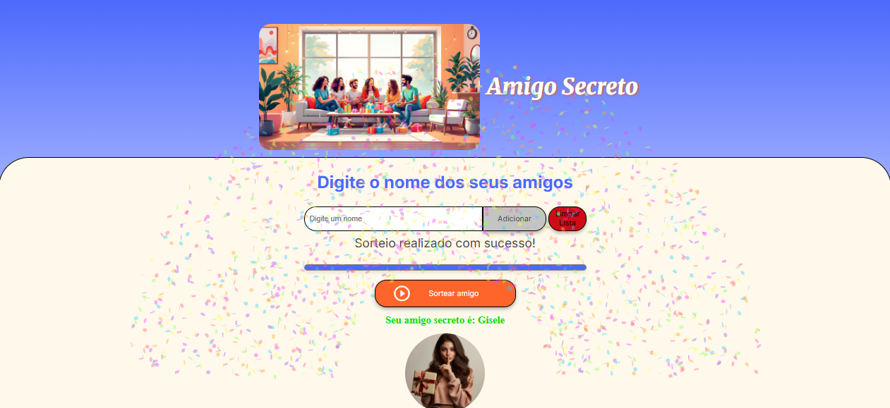

# 🎉 Challenge Amigo Secreto 🎉

[](LICENSE)
[](#)

> Código desenvolvido para sortear um amigo secreto a partir de uma lista de amigos. 🎉


## Índice

1.  [Funcionalidades do Projeto](#funcionalidades-do-projeto)
2.  [Layout](#layout)
3.  [Como Rodar Este Projeto?](#como-rodar-este-projeto)
4.  [Tecnologias Utilizadas](#tecnologias-utilizadas)
5.  [Autora do Projeto](#autora-do-projeto)
6.  [Licença](#licença)
7.  [Status do Projeto](#status-do-projeto)
8.  [Contribuição](#contribuição)

## Funcionalidades do Projeto

*   **Adicionar Amigos:**
    *   Permite aos usuários adicionar nomes de amigos ou colegas à lista de participantes do sorteio. Cada nome é armazenado e exibido na lista, garantindo que todos os participantes sejam considerados no sorteio.
    *   Ao digitar um nome no campo de entrada e clicar no botão "Adicionar", o nome é validado (para garantir que não esteja vazio) e adicionado à lista de amigos. Uma mensagem de sucesso é exibida para confirmar a ação.
    *   Facilita a criação da lista de participantes, permitindo que o usuário adicione quantos amigos desejar de forma rápida e intuitiva.

*   **Remover Amigos:**
    *   Oferece a flexibilidade de remover um amigo da lista, caso ele não possa participar do sorteio ou tenha sido adicionado por engano.
    *   Cada nome na lista de amigos possui um botão "Remover" associado. Ao clicar neste botão, o nome do amigo é removido da lista e uma mensagem de confirmação é exibida.
    *   Permite corrigir erros e ajustar a lista de participantes de forma fácil e rápida, garantindo que apenas os amigos que realmente participarão do sorteio sejam incluídos.

*   **Editar Amigos:**
    *   Permite aos usuários editar o nome de um amigo já adicionado à lista. Isso é útil para corrigir erros de digitação ou atualizar o nome de um participante.
    *   Ao clicar no botão "Editar" ao lado de um nome na lista, um campo de texto é exibido para que o usuário possa inserir o novo nome. Após a edição, o nome é atualizado na lista e uma mensagem de confirmação é exibida.
    *   Garante que os nomes na lista estejam sempre corretos e atualizados, evitando confusões e problemas no momento do sorteio.

*   **Limpar Lista:**
    *   Remove todos os nomes da lista de amigos de uma só vez, permitindo que o usuário comece do zero caso deseje criar uma nova lista.
    *   Ao clicar no botão "Limpar Lista", todos os nomes são removidos da lista e uma mensagem de confirmação é exibida.
    *   Economiza tempo e esforço, permitindo que o usuário limpe a lista inteira com apenas um clique, em vez de remover os nomes individualmente.

*   **Sortear Amigo Secreto:**
    *   Realiza o sorteio do amigo secreto de forma aleatória, garantindo que cada participante tenha a mesma chance de ser sorteado. O resultado do sorteio é exibido de forma clara e visível para o usuário.
    *   Ao clicar no botão "Sortear Amigo Secreto", o sistema seleciona um amigo aleatoriamente da lista e exibe o nome do amigo sorteado. A imagem de uma jovem aparece pedindo para manter o segredo e uma animação de confetes é exibida para celebrar o momento.
    *   Simplifica o processo de sorteio, eliminando a necessidade de realizar o sorteio manualmente. Garante a aleatoriedade e a imparcialidade do sorteio.

*   **Confetes:**
    *   Exibe uma animação de confetes ao sortear o amigo secreto para celebrar o momento e tornar a experiência mais divertida e festiva.
    *   Após o sorteio, uma animação de confetes é exibida na tela, criando um efeito visual atraente e emocionante.
    *   Adiciona um toque de diversão e emoção ao sorteio, tornando a experiência mais memorável e agradável para o usuário.

*   **Mensagens:**
    *   Exibe mensagens de sucesso e erro para guiar o usuário durante a utilização da aplicação. As mensagens fornecem feedback sobre as ações do usuário e ajudam a evitar erros.
    *   Mensagens de sucesso são exibidas quando uma ação é realizada com sucesso (por exemplo, ao adicionar um amigo ou sortear o amigo secreto). Mensagens de erro são exibidas quando ocorre um problema (por exemplo, ao tentar adicionar um nome vazio à lista).
    *   Melhora a usabilidade da aplicação, fornecendo feedback claro e conciso ao usuário. Ajuda a evitar erros e a resolver problemas de forma rápida e fácil.

## Layout

O layout do projeto foi desenvolvido com foco na usabilidade e na experiência do usuário, utilizando cores vibrantes e elementos visuais atraentes.

*   **Cores:**
    *   `--color-primary`: #4B69FD (Azul) - O azul foi escolhido como cor primária para transmitir confiança e seriedade, além de ser uma cor agradável aos olhos.
    *   `--color-secondary`: #FFF9EB (Amarelo Claro) - O amarelo claro foi utilizado como cor secundária para criar um contraste suave com o azul e transmitir alegria e otimismo.
    *   `--color-tertiary`: #C4C4C4 (Cinza) - O cinza foi utilizado para elementos neutros, como bordas e botões, para não distrair a atenção do usuário.
    *   `--color-button`: #fe652b (Laranja) - O laranja foi escolhido para os botões para chamar a atenção do usuário e incentivá-lo a interagir com a aplicação.
    *   `--color-button-hover`: #e55720 (Laranja Escuro) - O laranja escuro foi utilizado para o efeito hover dos botões para fornecer feedback visual ao usuário quando ele interage com os botões.
    *   `--color-text`: #444444 (Cinza Escuro) - O cinza escuro foi utilizado para o texto para garantir a legibilidade e o contraste com o fundo.
    *   `--color-white`: #FFFFFF (Branco) - O branco foi utilizado para o fundo e outros elementos para criar um design limpo e moderno.
    *   As cores foram escolhidas considerando a acessibilidade para usuários com daltonismo, garantindo que a aplicação seja utilizável por todos.

*   **Fontes:**
    *   `Inter`: A fonte Inter foi escolhida para os textos gerais por ser uma fonte moderna, legível e com boa aparência em diferentes tamanhos de tela.
    *   `Merriweather`: A fonte Merriweather foi utilizada para os títulos por ser uma fonte elegante e com estilo itálico, o que a torna ideal para destacar os títulos.
    *   As fontes foram utilizadas para criar uma hierarquia visual na página, facilitando a leitura e a compreensão do conteúdo.

*   **Layout Geral:**
    *   O layout é responsivo e se adapta a diferentes tamanhos de tela usando media queries.
    *   Flexbox foi utilizado para criar o layout, o que permitiu criar um design flexível e fácil de manter.
    *   A página é dividida em três seções principais: header, main e footer. O header contém o título e a imagem principal, o main contém o conteúdo principal da aplicação e o footer contém informações adicionais.
    *   O espaçamento foi utilizado para criar um design limpo e organizado, com margens e paddings adequados para cada elemento.

*   **Elementos Visuais:**
    *   A imagem principal foi escolhida para transmitir a ideia de sorteio e diversão.
    *   Ícones foram utilizados para representar as ações disponíveis na aplicação, como adicionar, remover e editar amigos.
    *   A animação de confetes foi utilizada para tornar a experiência mais divertida e envolvente.

*   **Usabilidade:**
    *   A navegação foi projetada para ser fácil e intuitiva, com botões claros e mensagens de feedback para o usuário.
    *   O feedback visual é fornecido ao usuário quando ele interage com a aplicação, como o efeito hover nos botões e as mensagens de sucesso e erro.
    *   O layout foi projetado considerando a acessibilidade para usuários com deficiência visual ou outras necessidades especiais, como o uso de cores contrastantes e fontes legíveis.

* **Veja como ficou o layout inicial:**



* **Veja como fica o layout a cada sorteio:**


## Como Rodar Este Projeto?

Siga estas etapas para executar o projeto em sua máquina local:

1.  **Clone o repositório:**

    ```bash
    git clone https://github.com/[seu-usuario]/amigo-secreto.git 
    ```
2.  **Navegue até o diretório do projeto:**

    ```bash
    cd amigo-secreto
    ```
3.  **Abra o arquivo `index.html` em seu navegador.**

## Tecnologias Utilizadas

*   **HTML:** Estrutura da página web.
*   **CSS:** Estilização da página web.
*   **JavaScript:** Lógica da aplicação.
*   **[Canvas Confetti](https://www.npmjs.com/package/canvas-confetti):** Biblioteca para a animação de confetes.

## Autora do Projeto

**Gisele Lima**

*   [LinkedIn](https://www.linkedin.com/in/gisele-lima-tech/)
*   [GitHub](https://github.com/GiseleLima-AI)

## Licença

Este projeto está licenciado sob a licença MIT - veja o arquivo [LICENSE](LICENSE) para detalhes.

## Status do Projeto

Concluído! 🎉 As funcionalidades propostas neste projeto foram implementadas com sucesso.

## Contribuição

Contribuições são sempre bem-vindas! Sinta-se à vontade para abrir issues e enviar pull requests.

### Como Contribuir

1.  Faça um fork do repositório.
2.  Crie uma branch para sua feature (`git checkout -b feature/sua-feature`).
3.  Faça commit de suas mudanças (`git commit -am 'Adiciona nova feature'`).
4.  Faça push para a branch (`git push origin feature/sua-feature`).
5.  Abra um pull request.